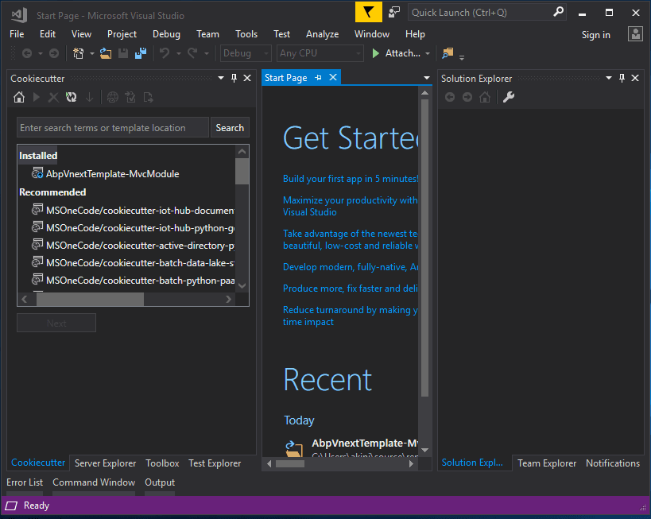
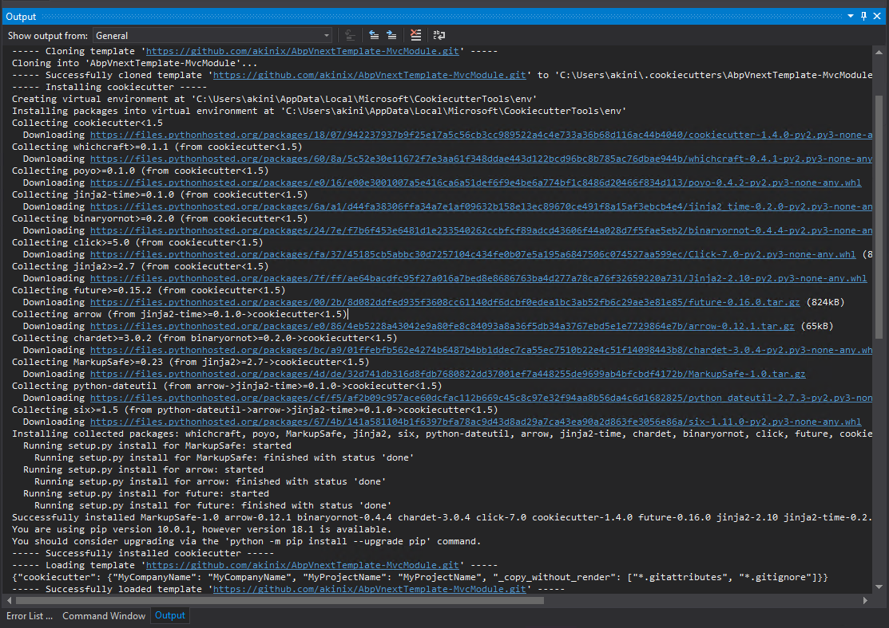
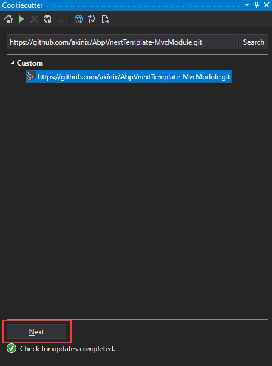
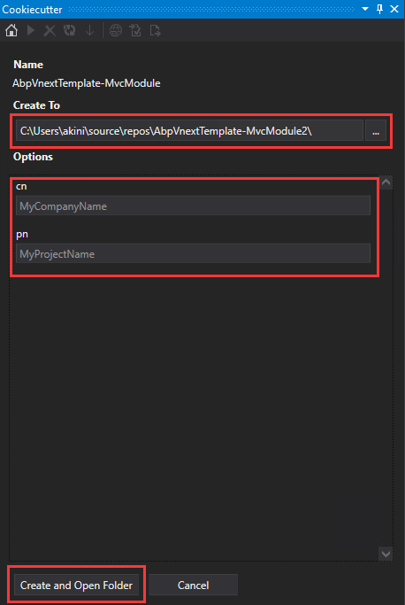
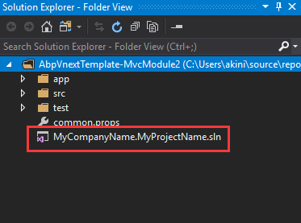
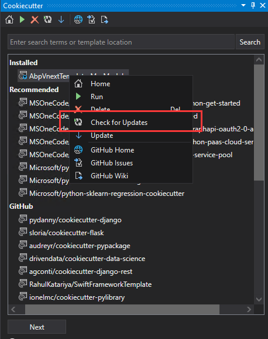
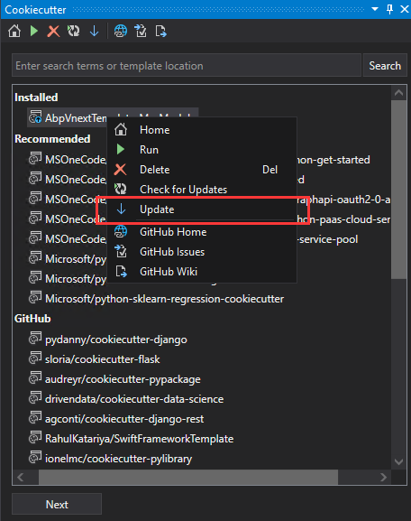

# Abp vNext Cookiecutter Template MvcModule
# Overview

[Abp vNext](Https://abp.io/) Template.



[Cookiecutter](https://github.com/audreyr/cookiecutter) is a popular Open Source templating engine that lets experts easily create highly customizable templates to help other users get started on a project. .

`Cookiecutter` is integrated vs2017. you can create a project directly in vs2017 using the `Cookiecutter ` template.

Using `Cookiecutter` to create `Abp vNext` projects is faster,  and supports updates if the templates has been modified. project should be created offline when the template has already been cloned.

> you can also download projects from [Abp vNext](Https://abp.io/) .


# Usage

## Prerequisites

the directory or file name in this template looks like this `{{cookiecutter.cname}}.{{cookiecutter.pname}}.Application`.  

the length of the name has been changed very long, but in windows, the length of full path is limited to 260 characters.   

### Edit Group Policy

- Open Group Policy Editor (Press Windows Key and type gpedit.msc and hit Enter key.
- Navigate to the following directory:  Local Computer Policy > Computer Configuration > Administrative Templates > System > Filesystem.
- Click Enable `Enabling Win32 long paths` option and enable it.

### Edit Git

- run the `git bash` command

  ```shell
  git config --system core.longpaths true
  ```


## Install Template

- open VS2017,  click `File`-`New`-`From Cookiecutter...`,  open side bar  `Cookiecutter`

  


- input `https://github.com/akinix/AbpVnextTemplate-MvcModule.git`, click`Search`

  

- if first download template using `Cookiecutter`,  need to install some dependencies for `Cookiecutter`. 

  

- get the result for search. click `Next`.

  

- the repository will be clone into `C:\Users\youname\.cookiecutters\AbpVnextTemplate-MvcModule`.

  

  


## Create Project

Choosing the template `AbpvNextTemplate-MvcModule`, and hitting next clones the repository and takes you to a form where you can enter values for template variables specified in the template’s `cookiecutter.json` file.

You can also choose the location where you would like the project folder to be created. For this `Abp vNext  MvcModule` project, you specify our desired `cn` and `pn` (**order to reduce the length of path**).

- cn: company name 
- pn: project name



Click `Creage and Open Folder` to generate project files. Once generated, you can choose to open it in the Solution Explorer. Here’s our newly created project open in it. 



## Update Template

you can update template when the repository has new version.

-  check for updates for the installed templates anytime by right clicking on a template and choosing the option in the context menu.

  

  